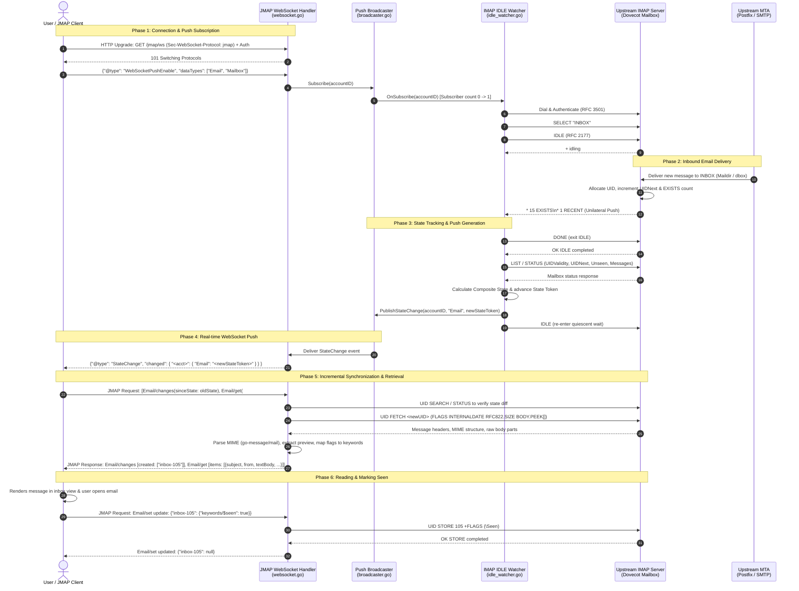

# End-to-End Inbound Mail Processing: IMAP Delivery to JMAP WebSocket Push and Client Retrieval

## Executive Summary

This document details the exact sequence of events that occurs when an inbound email arrives at an upstream classical IMAP server (e.g. Dovecot) and is pushed in real time via **JMAP WebSockets** ([RFC 8887](https://www.rfc-editor.org/rfc/rfc8887.html)) to a connected JMAP mail client, which then incrementally synchronizes and reads the message using **JMAP Core** ([RFC 8620](https://www.rfc-editor.org/rfc/rfc8620.html)) and **JMAP Mail** ([RFC 8621](https://www.rfc-editor.org/rfc/rfc8621.html)).

The implementation in `imap-jmap` acts as a zero-disk-storage stateless protocol gateway: it does not store user emails in an internal database. Instead, it dynamically translates between IMAP4rev1/rev2 protocols (including [RFC 2177](https://www.rfc-editor.org/rfc/rfc2177.html) IMAP IDLE) and the modern JSON-based JMAP specifications.

---

## 1. Architectural Components & Protocol Map

```
+--------------------------------------------------------------------------------------------------+
|                                         EXTERNAL SYSTEMS                                         |
|                                                                                                  |
|   +-----------------------+              SMTP / LMTP             +---------------------------+   |
|   | External Mail Sender  | -----------------------------------> | Upstream Mail Server      |   |
|   | (MTA / Remote Client) |                                      | (Postfix / Dovecot / MDA) |   |
|   +-----------------------+                                      +-------------+-------------+   |
+--------------------------------------------------------------------------------|-----------------+
                                                                                 |
                                                                   IMAP4rev1/rev2| (RFC 3501/9051)
                                                                   & RFC 2177    | Mailbox updates
                                                                   IMAP IDLE     v
+--------------------------------------------------------------------------------------------------+
|                                   IMAP-JMAP GATEWAY (Stateless)                                  |
|                                                                                                  |
|   +------------------------------------------------------------------------------------------+   |
|   | IMAP/SMTP Gateway Backend (`jmap/imapsmtp`)                                              |   |
|   |                                                                                          |   |
|   |   +------------------------------------+    +----------------------------------------+   |   |
|   |   | On-Demand IMAP IDLE Watcher        |    | Composite State & Change Tracker       |   |   |
|   |   | (`idle_watcher.go`)                |    | (`change_tracker.go`)                  |   |   |
|   |   +-----------------+------------------+    +-------------------+--------------------+   |   |
|   |                     |                                           |                        |   |
|   |                     +---------------------+---------------------+                        |   |
|   |                                           |                                              |   |
|   |                                           v                                              |   |
|   |                           +-------------------------------+                              |   |
|   |                           | Push Broadcaster Subsystem    |                              |   |
|   |                           | (`jmap/jmappush`)             |                              |   |
|   |                           +---------------+---------------+                              |   |
|   +-------------------------------------------|----------------------------------------------+   |
|                                               |                                                  |
|                                               v Internal event dispatch                          |
|   +------------------------------------------------------------------------------------------+   |
|   | JMAP HTTP & WebSocket Transport Engine (`jmap`)                                          |   |
|   |                                                                                          |   |
|   |   +----------------------------------------------------------------------------------+   |   |
|   |   | WebSocket Subprotocol Handler (`websocket.go`)                                   |   |   |
|   |   | RFC 8887 subprotocol "jmap"                                                      |   |   |
|   |   +----------------------------------------------------------------------------------+   |   |
|   |   | JMAP Request Dispatcher & Reference Resolver (`server.go`, `email_handlers.go`)  |   |   |
|   |   | RFC 8620 Method Invocation & Result References                                   |   |   |
|   |   +----------------------------------------------------------------------------------+   |   |
|   +-------------------------------------------^----------------------------------------------+   |
+-----------------------------------------------|--------------------------------------------------+
                                                |
                                                | WSS (TLS WebSocket) / HTTPS
                                                | RFC 8887 & RFC 8620
                                                v
+--------------------------------------------------------------------------------------------------+
|                                        JMAP MAIL CLIENT                                          |
|                                                                                                  |
|   +------------------------------------------------------------------------------------------+   |
|   | Modern Webmail / Desktop / Mobile Mail User Agent (e.g., Stalwart, Roundcube Next, etc.)  |   |
|   +------------------------------------------------------------------------------------------+   |
+--------------------------------------------------------------------------------------------------+
```

---

## 2. End-to-End Sequence Diagram

The following sequence diagram tracks the entire lifecycle from the client connecting and enabling push, to mail delivery on Dovecot, IDLE event handling, WebSocket push emission, and incremental fetching with body parsing:



---

## 3. Detailed Step-by-Step Lifecycle

### Step 1: Session Discovery and WebSocket Negotiation
1. **Capability Discovery**:
   The client makes an authenticated HTTP GET request to the JMAP session endpoint (`/.well-known/jmap` or `/jmap/session`) per [RFC 8620 Section 2](https://www.rfc-editor.org/rfc/rfc8620.html#section-2).
   The server advertises the WebSocket capability defined in [RFC 8887](https://www.rfc-editor.org/rfc/rfc8887.html):
   ```json
   {
     "capabilities": {
       "urn:ietf:params:jmap:core": { ... },
       "urn:ietf:params:jmap:mail": { ... },
       "urn:ietf:params:jmap:websocket": {
         "wsUrl": "wss://mail.example.com/jmap/ws",
         "supportsPush": true
       }
     },
     "accounts": { ... },
     "primaryAccounts": { "urn:ietf:params:jmap:mail": "a6e974cb" }
   }
   ```
2. **WebSocket Handshake**:
   The client establishes a secure TLS connection and issues an HTTP Upgrade request:
   ```http
   GET /jmap/ws HTTP/1.1
   Host: mail.example.com
   Upgrade: websocket
   Connection: Upgrade
   Sec-WebSocket-Key: dGhlIHNhbXBsZSBub25jZQ==
   Sec-WebSocket-Version: 13
   Sec-WebSocket-Protocol: jmap
   Authorization: Bearer <session-token>
   ```
3. **Authentication & Connection Upgrade**:
   The `auth_middleware.go` middleware validates the bearer token or credentials against the user directory and injects the `accountID`, `username`, and credentials into the Go `context.Context`.
   In [`HandleWebSocket`](file:///home/martino/git/imap-jmap/jmap/websocket.go#L18-L38):
   - The server verifies `Sec-WebSocket-Protocol` matches `"jmap"` (RFC 8887 Section 3).
   - Upgrades the connection using `github.com/coder/websocket` to full-duplex TCP/TLS WebSocket with status `101 Switching Protocols`.

---

### Step 2: Push Registration and Dynamic On-Demand IMAP IDLE
In order to conserve upstream server resources, `imap-jmap` **does not** hold open idle connections to Dovecot for disconnected users. The IMAP IDLE connection is provisioned dynamically on-demand:

1. **Client Sends Push Enablement**:
   Over the WebSocket connection, the client sends a `WebSocketPushEnable` frame per [RFC 8887 Section 4.3.5.2](https://www.rfc-editor.org/rfc/rfc8887.html#section-4.3.5.2):
   ```json
   {
     "@type": "WebSocketPushEnable",
     "dataTypes": ["Email", "Mailbox", "Thread"]
   }
   ```
2. **Subscription Listener Notification**:
   In [`HandleWebSocket`](file:///home/martino/git/imap-jmap/jmap/websocket.go#L166-L188):
   - The connection marks `pushEnabled = true` and records the requested `dataTypes`.
   - It calls `s.Broadcaster.Subscribe(accountID)`.
   In [`jmap/jmappush/broadcaster.go`](file:///home/martino/git/imap-jmap/jmap/jmappush/broadcaster.go#L75-L92):
   - If the active subscriber count for that `accountID` transitions from 0 to 1, the `Broadcaster` fires `SubscriptionListener.OnSubscribe(accountID)`.
3. **Starting the On-Demand IDLE Watcher**:
   The `IMAPSMTPBackend` implements `SubscriptionListener` ([`backend.go`](file:///home/martino/git/imap-jmap/jmap/imapsmtp/backend.go#L282-L297)):
   - It invokes `b.startIdleWatcher(accountID, creds)`.
   In [`idle_watcher.go`](file:///home/martino/git/imap-jmap/jmap/imapsmtp/idle_watcher.go#L18-L53):
   - A dedicated background goroutine runs `runIdleLoop`.
   - It dials the upstream IMAP server using [`imap.DialIdle`](file:///home/martino/git/imap-jmap/imap/client.go#L82-L137) with the user's IMAP credentials.
   - It registers unilateral update hooks for `Mailbox`, `Expunge`, and `Fetch`.
   - It issues `SELECT "INBOX"`, followed by the IMAP `IDLE` command per [RFC 2177](https://www.rfc-editor.org/rfc/rfc2177.html).
   - The connection enters quiescent wait. A 15-minute keepalive timer ensures the command is re-issued before the 29-minute timeout specified in RFC 2177 Section 3.

---

### Step 3: Upstream Mail Delivery to IMAP Server
1. An external SMTP server delivers a new message to the user's mailbox via standard MTA delivery (e.g. Postfix -> Dovecot LMTP).
2. The MDA writes the message into the user's storage (`~/Maildir/new/` or `dbox`).
3. Dovecot updates its internal index files (`dovecot.index`), assigning the next sequential IMAP UID (e.g. `UID 105`) and updating folder metrics:
   - `UIDNext` advances (e.g., from `105` to `106`).
   - `EXISTS` message count increments (e.g., from `14` to `15`).
   - `RECENT` count increments.

---

### Step 4: Unilateral IMAP IDLE Update Handling & State Calculation
1. **Unsolicited IMAP Response**:
   Because the gateway's IDLE watcher has `INBOX` open in IDLE state, Dovecot immediately transmits untagged unilateral responses down the connection:
   ```imap
   * 15 EXISTS
   * 1 RECENT
   ```
2. **Event Trigger in Gateway**:
   The underlying `github.com/emersion/go-imap/v2` parser receives the untagged frame and triggers `opts.UnilateralDataHandler.Mailbox()`.
   The callback in [`idle_watcher.go`](file:///home/martino/git/imap-jmap/jmap/imapsmtp/idle_watcher.go#L81-L84) executes:
   ```go
   Mailbox: func() {
       slog.Debug("IMAP IDLE received Mailbox unilateral update", "accountID", accountID)
       triggerNotify()
   }
   ```
3. **Exiting IDLE and Querying Folder State**:
   - `triggerNotify()` sends an event down `notifyCh`.
   - `runIdleLoop` closes `idleCmd` by sending `DONE` to the IMAP server.
   - To compute the new state, the backend invokes [`GetCurrentCompositeState(ctx)`](file:///home/martino/git/imap-jmap/jmap/imapsmtp/change_tracker.go#L67-L108).
   - It issues IMAP `LIST` / `STATUS` across the user's mailboxes, collecting:
     - `UIDValidity`: mailbox identifier stability.
     - `UIDNext`: high-water mark for new messages.
     - `Messages`: total message count.
     - `Unseen`: unread message count.
4. **Encoding Composite State**:
   In `change_tracker.go`, the folder states and sequence counter are encoded into a compact, deterministic string token:
   ```go
   token := cs.Encode() // e.g. "v1-0-inbox:168000:106:15:1"
   ```
5. **Publishing StateChange**:
   The backend updates `b.lastStates[accountID] = token` and publishes the mutation to the broadcaster:
   ```go
   b.broadcaster.PublishStateChange(accountID, "Email", token)
   b.broadcaster.PublishStateChange(accountID, "Mailbox", token)
   b.broadcaster.PublishStateChange(accountID, "Thread", token)
   ```
6. **Re-entering IDLE**:
   The IDLE watcher goroutine immediately calls `client.Idle()` again to resume listening for subsequent arrivals.

---

### Step 5: WebSocket Push Dispatch (RFC 8887)
1. In [`jmap/jmappush/broadcaster.go`](file:///home/martino/git/imap-jmap/jmap/jmappush/broadcaster.go#L113-L137), `PublishStateChange` constructs a `StateChange` object:
   ```json
   {
     "Type": "StateChange",
     "Changed": {
       "a6e974cb": {
         "Email": "v1-0-inbox:168000:106:15:1",
         "Mailbox": "v1-0-inbox:168000:106:15:1",
         "Thread": "v1-0-inbox:168000:106:15:1"
       }
     }
   }
   ```
2. In [`jmap/websocket.go`](file:///home/martino/git/imap-jmap/jmap/websocket.go#L49-L93), `startPushLoop` receives the event over `pushCh`.
3. It filters the event against the client's registered `dataTypes` (e.g. `"Email"`, `"Mailbox"`).
4. The server writes a text frame containing the push notification over the WebSocket:
   ```json
   {
     "@type": "StateChange",
     "changed": {
       "a6e974cb": {
         "Email": "v1-0-inbox:168000:106:15:1",
         "Mailbox": "v1-0-inbox:168000:106:15:1"
       }
     }
   }
   ```

---

### Step 6: Client Reaction & Incremental Retrieval via JMAP
When the JMAP client receives the `StateChange` frame over the WebSocket, it notes that its local state token for `Email` (e.g. `v1-0-inbox:168000:105:14:0`) differs from the server's new state.

Rather than issuing multiple slow round trips or blindly re-fetching the entire inbox, an RFC-compliant JMAP client sends a single, pipelined request with **Result Reference Chaining** ([RFC 8620 Section 3.3](https://www.rfc-editor.org/rfc/rfc8620.html#section-3.3)):

#### The Client's JMAP Request (over WebSocket or HTTP POST)
```json
{
  "using": [
    "urn:ietf:params:jmap:core",
    "urn:ietf:params:jmap:mail"
  ],
  "methodCalls": [
    [
      "Email/changes",
      {
        "accountId": "a6e974cb",
        "sinceState": "v1-0-inbox:168000:105:14:0"
      },
      "c1"
    ],
    [
      "Email/get",
      {
        "accountId": "a6e974cb",
        "#ids": {
          "resultOf": "c1",
          "name": "Email/changes",
          "path": "/created"
        },
        "properties": [
          "id",
          "blobId",
          "threadId",
          "mailboxIds",
          "keywords",
          "size",
          "receivedAt",
          "from",
          "to",
          "subject",
          "preview",
          "hasAttachment",
          "bodyValues",
          "textBody",
          "htmlBody"
        ],
        "fetchTextBodyValues": true,
        "fetchHTMLBodyValues": true
      },
      "c2"
    ]
  ]
}
```

---

### Step 7: Gateway Execution & Upstream IMAP Translation

1. **Processing `Email/changes`**:
   - The gateway's change tracker ([`EmailChanges`](file:///home/martino/git/imap-jmap/jmap/imapsmtp/change_tracker.go#L184-L270)) decodes `sinceState` and compares it with `currentState`.
   - It detects that in the `INBOX` folder, `oldUIDNext` was `105` and `newUIDNext` is `106`.
   - It computes the created set without requiring a database query:
     ```go
     // New messages appended
     for uid := oldFS.UIDNext; uid < newFS.UIDNext; uid++ {
         createdSet[EmailIDFor(mbID, uid)] = true
     }
     ```
   - It assigns the composite JMAP Email ID: `"inbox-105"`.
   - It records the result for invocation `"c1"`:
     ```json
     {
       "accountId": "a6e974cb",
       "oldState": "v1-0-inbox:168000:105:14:0",
       "newState": "v1-0-inbox:168000:106:15:1",
       "hasMoreChanges": false,
       "created": ["inbox-105"],
       "updated": [],
       "destroyed": []
     }
     ```

2. **Resolving the Result Reference (`#ids`)**:
   - In [`server.go`](file:///home/martino/git/imap-jmap/jmap/server.go), `resolveResultReferences` inspects `#ids`.
   - It evaluates JSON Pointer `/created` against call `"c1"`, resolving `#ids` into `["inbox-105"]`.

3. **Executing `Email/get` Against IMAP**:
   In [`GetEmails`](file:///home/martino/git/imap-jmap/jmap/imapsmtp/email_read.go#L41-L105):
   - It parses `"inbox-105"` into mailbox `"INBOX"` and UID `105`.
   - It borrows an authenticated IMAP client from `b.pool`.
   - It issues an IMAP fetch command:
     ```imap
     TAG1 UID FETCH 105 (FLAGS INTERNALDATE RFC822.SIZE BODY.PEEK[])
     ```
   - Dovecot streams the raw RFC 5322 MIME message bytes.

4. **Standards-Compliant MIME Parsing**:
   Per the project's strict parsing rules, the gateway parses the message using `github.com/emersion/go-message/mail`:
   - Decodes Content-Transfer-Encoding (`quoted-printable`, `base64`).
   - Converts character sets (e.g. `ISO-8859-1`, `Windows-1252`) into standard UTF-8.
   - Extracts plain text and HTML bodies into `bodyValues`.
   - Computes a clean plain-text `preview` (up to 256 characters) per RFC 8621 Section 4.1.1.
   - Maps IMAP system flags (`\Seen`, `\Flagged`, `\Draft`, `\Answered`) into JMAP keywords (`$seen`, `$flagged`, etc.).
   - Converts `INTERNALDATE` to RFC 3339 UTC timestamp for `receivedAt`.

---

### Step 8: JMAP Response to Client & User Interface Rendering

The server transmits the complete response back over the WebSocket:

```json
{
  "methodResponses": [
    [
      "Email/changes",
      {
        "accountId": "a6e974cb",
        "oldState": "v1-0-inbox:168000:105:14:0",
        "newState": "v1-0-inbox:168000:106:15:1",
        "hasMoreChanges": false,
        "created": ["inbox-105"],
        "updated": [],
        "destroyed": []
      },
      "c1"
    ],
    [
      "Email/get",
      {
        "accountId": "a6e974cb",
        "state": "v1-0-inbox:168000:106:15:1",
        "list": [
          {
            "id": "inbox-105",
            "blobId": "b-inbox-105",
            "threadId": "t-d41d8cd98f00b204",
            "mailboxIds": { "inbox": true },
            "keywords": {},
            "size": 2450,
            "receivedAt": "2026-09-18T20:41:00Z",
            "from": [
              { "name": "Alice Smith", "email": "alice@external-domain.com" }
            ],
            "to": [
              { "name": "Bob User", "email": "bob@example.com" }
            ],
            "subject": "Quarterly Planning Review",
            "preview": "Hi Bob, here is the updated agenda for tomorrow's review meeting...",
            "hasAttachment": false,
            "bodyValues": {
              "1": {
                "value": "Hi Bob,\n\nHere is the updated agenda for tomorrow's review meeting.\n\nBest,\nAlice",
                "isTruncated": false
              }
            },
            "textBody": [
              { "partId": "1", "type": "text/plain" }
            ]
          }
        ],
        "notFound": []
      },
      "c2"
    ]
  ],
  "sessionState": "1"
}
```

#### What the User Sees:
- The webmail/client UI instantly displays a new notification badge and inserts the row into the inbox list.
- Since `keywords` does not contain `"$seen"`, the item is highlighted as **unread**.
- Clicking the email displays the parsed headers and formatted body immediately from the returned `bodyValues`.

---

### Step 9: Marking the Email as Read (`$seen`)

When the user opens and views the message, the client marks it as read by sending an `Email/set` patch:

```json
{
  "using": ["urn:ietf:params:jmap:core", "urn:ietf:params:jmap:mail"],
  "methodCalls": [
    [
      "Email/set",
      {
        "accountId": "a6e974cb",
        "update": {
          "inbox-105": {
            "keywords/$seen": true
          }
        }
      },
      "u1"
    ]
  ]
}
```

1. The gateway extracts the JSON pointer path `keywords/$seen` and UID `105`.
2. It maps `$seen: true` to the IMAP flag `\Seen` ([`convert.go`](file:///home/martino/git/imap-jmap/imap/convert.go#L88-L108)).
3. It issues the IMAP flag store command:
   ```imap
   TAG2 UID STORE 105 +FLAGS (\Seen)
   ```
4. Dovecot updates its flags in the mailbox index.
5. The gateway responds to the client:
   ```json
   {
     "methodResponses": [
       [
         "Email/set",
         {
           "accountId": "a6e974cb",
           "updated": {
             "inbox-105": null
           }
         },
         "u1"
       ]
     ]
   }
   ```
6. The email's read status is now fully synchronized across both JMAP and any classical IMAP clients connected to the same account.

---

## 4. Key Architectural Safeguards & RFC Conformance

| Mechanism | RFC Standard | Implementation in `imap-jmap` |
|---|---|---|
| **Zero Idle Connection Waste** | RFC 8887 §4.3.5 / RFC 2177 | IDLE watcher is spawned **only** when active WebSocket push subscribers exist, and canceled as soon as they disconnect via `SubscriptionListener`. |
| **Coalesced Push Events** | RFC 8620 §7.1 / RFC 8887 | Multi-delivery bursts drain buffered notification channels to emit a single consolidated `StateChange` rather than flooding the client. |
| **Keepalive Safety** | RFC 2177 §3 | Re-issues IMAP `IDLE` every 15 minutes to guarantee connection liveness well within the 29-minute IMAP timeout window. |
| **Strict Parser Integrity** | RFC 5322 / RFC 2045 | Never uses regex or manual string splitting for MIME bodies; relies on `go-message/mail` standard parser. |
| **Result Reference Resolution** | RFC 8620 §3.3 | Resolves `#ids` back-references across method calls within a single request, eliminating extra round-trips. |
| **Composite State Tracking** | RFC 8620 §5.2 | Deterministically encodes `UIDValidity`, `UIDNext`, and `Unseen` metrics so state tokens accurately represent mailbox evolution without local database storage. |
